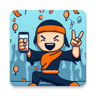

# Ninja Win

The objective of this project was to explore the use of Generative Artificial Intelligence (AI) in application development. The goal was kept intentionally simple: build and publish an Android app that plays a celebratory sound when the user presses a button.

[Ninja Win](https://play.google.com/store/apps/details?id=com.coresoftwaredesign.ninjawin) is available for Android devices on Google Play.

## Generative AI

* Images were generated with Microsoft Bing Image Creator powered by DALL-E.
* Software and text were generated with Google Bard (ChatGPT4).
* Free accounts were used in all cases.

### Software Development

* Bard was efficient at creating the initial application framework compared to manual coding.
* Bard had issues when asked to combine multiple, complex criteria.
* Parts of the prompt become ignored as complexity increases.
* Ultimately, portions of final code were generated separately by AI and then integrated manually.

### Application Graphics

* DALL-E was also efficient at creating graphics.
* Graphics were limited to 1024 x 1024 px resolution.
* We were unsuccessful in create images with transparent pixels. 
* We were unable to get DALL-E to create the same button in both the up and down position.
* Photoshop was used to manually create the up and down states and then process and export the source images for the custom button.

### Play Store Graphics

* DALL-E was very effective for creating the app icon.
* The AI generated multiple versions to select from.
* The AI was able to coordinate the image and colors.
* I was unable to force the AI to stay constrained within the 1024 x 500 space allowed for feature graphics.

## Prompt Engineering

Included below are the actual prompts used to generate the assets used in this project.

### Software

> Write the code for an android app. The app should present a large image button. The button should play a sound file when pressed down. Lifting up of the button has no effect. Button press should not be handled if the sound file is actively playing. The sound file should not be started if it is already playing. The sound should stop if the activity is paused. Use Java as the programming language.

### App Icon

> Create a Google Play Store App Icon for an android app. The app is named Ninja Win. Include a person holding the phone and celebrating. The person should look very happy. Have balloons, confetti, and cheering crowds in the background. Background colors should be blue. Highlight colors should be orange.

### Background Graphic

 > Create a photo-realistic image of an athlete racing in an obstacle course.

### Button Graphic

> Draw a plain undecorated red rounded push button in the up position. Draw the same button in the down position. Use a perspective view.

### Play Store Description

> Write a Google Play Store Description for an app named Ninja Win. The description should be two or three paragraphs. The app plays an air horn sound and crowd noise when a button is pressed. The button can be used to celebrate completing a task. Use a young, playful and exciting tone.

*Ninja Win is the perfect app for anyone who loves to celebrate their accomplishments. With just a tap of a button, you can unleash a deafening air horn blast and a raucous crowd cheer. It's the perfect way to mark your victory, whether you're just finishing a tough workout, completing a challenging task, or winning a big game.*

*So what are you waiting for? Download Ninja Win today and start celebrating your victories in style!*

## Observations

Generative AI is a very useful tool and can be leveraged for improved code, graphics and text generation. Using AI allows a team to offload simple, repetitive tasks to AI apps so they can focus on integration issues. 

A skilled team with development, UX and graphics design skills is still required to create secure, production-ready applications.

### Pros

* AI tools are very efficient at specific code generation tasks. This is understandable as code is largely based on patterns.
* Creating graphics via prompts is faster and results in better results compared to manually drawing new art or searching for existing clip art.
* Generative AI is a very useful tool and should be leveraged for code, graphics and text generation. This allows a team to offload simple, repetitive tasks to the AI so they can focus on larger integration issues.

### Cons

* Current large language models are unable to combine all the features required to create production-ready code in a single prompt. Application integration still requires a developer to assemble the components into a finished application.
* Most images will require some manual assembly to create a finished result.
* We were unable to find a suitable AI tool for generating audio. The audio file for the app was created from open-source audio clips and then mixed with a conventional DAW.
* AI tools were limited to seaching when applied to administrative tasks such as Google Play Console application setup, release management, play store setup, etc.
* Results are not reproducible. Different results are returned depending on the date and time prompts are run. AI's are continually updated and tuned, making it impossible to rerun old prompts to make minor adjustments.

This project is licensed under the terms of the MIT license. See the LICENSE.md file for more info.